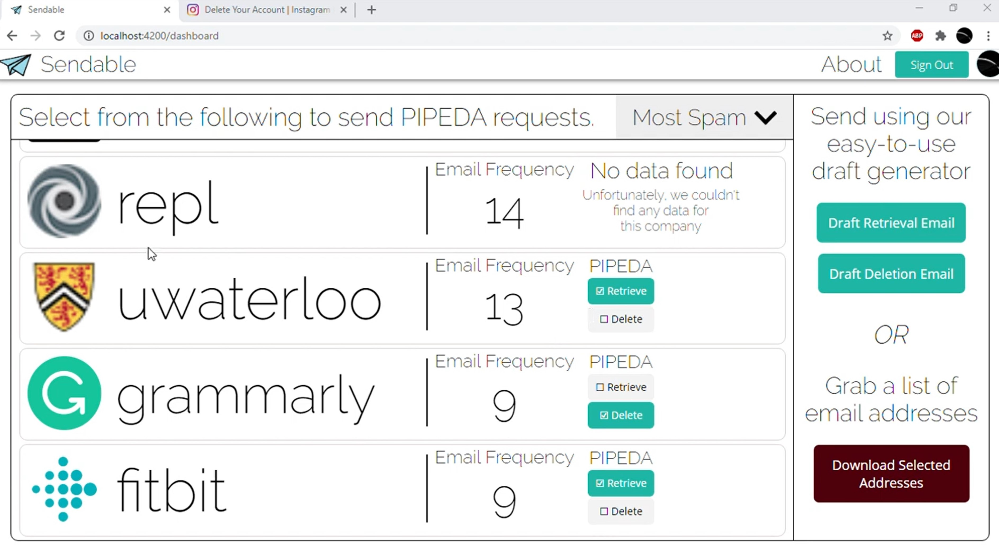
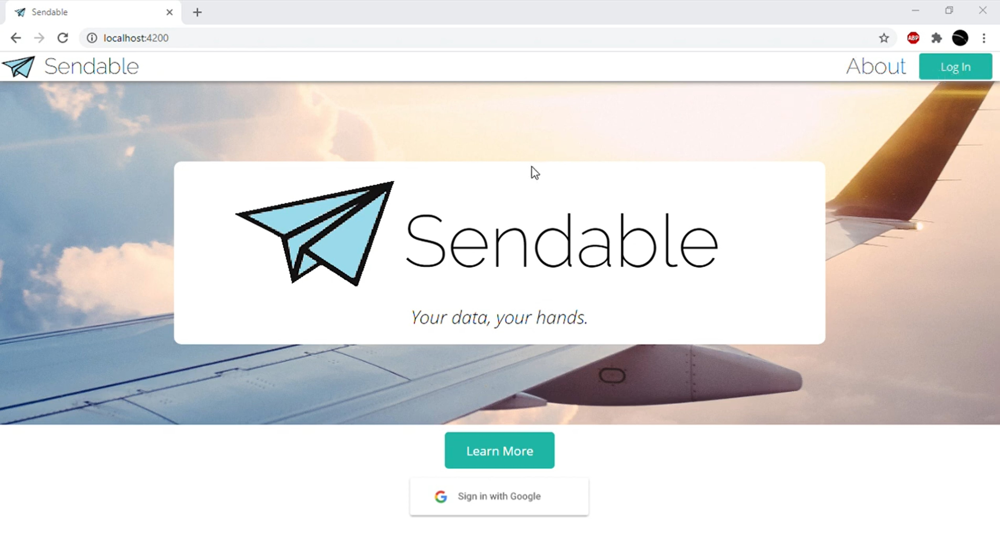

# SendableCS

Sendable is a web app created with Angular, Firebase Tools (Authentication, Cloud Functions, Realtime DB) and the Google Drive API. It scans a user's email data (once uploaded to their Google Drive) and produces a list of companies that the user is subscribed with. In addition, it uses a Cloud Function custom web scraper to find privacy-handling emails of each of those companies, and includes an option in the subscription list to draft a PIPEDA request email in legal language for the user. Once a specific company's data has been searched, the algorithm saves data about that company to a central database, to prevent multiple webscrapes to the same site.

PIPEDA requests are written statements sent to companies by consumers that allows for the retrieval or deletion of an individual's personal data from company databases. Sendable automates this process to make privacy more accessible to all.

View a video demo of Sendable [here](https://www.youtube.com/watch?v=EvVwd-5UGgg).

